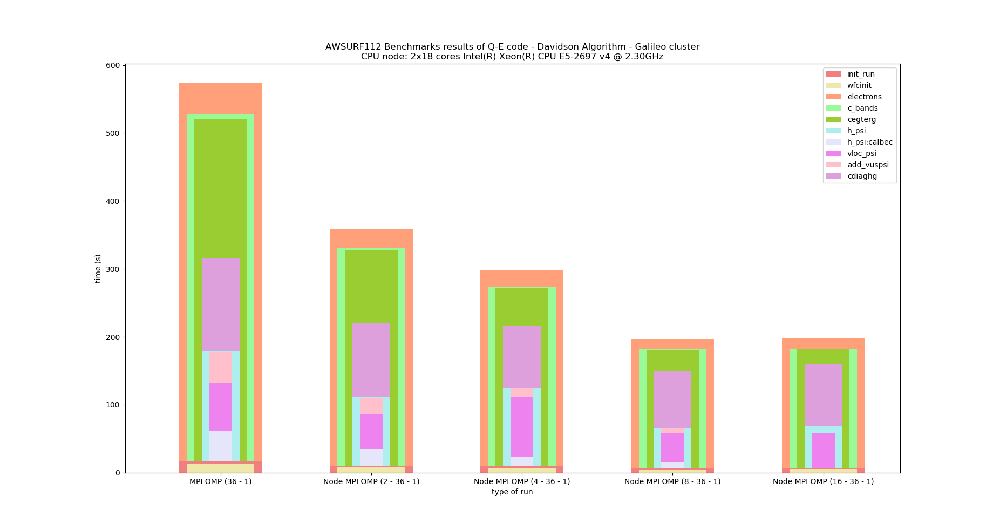
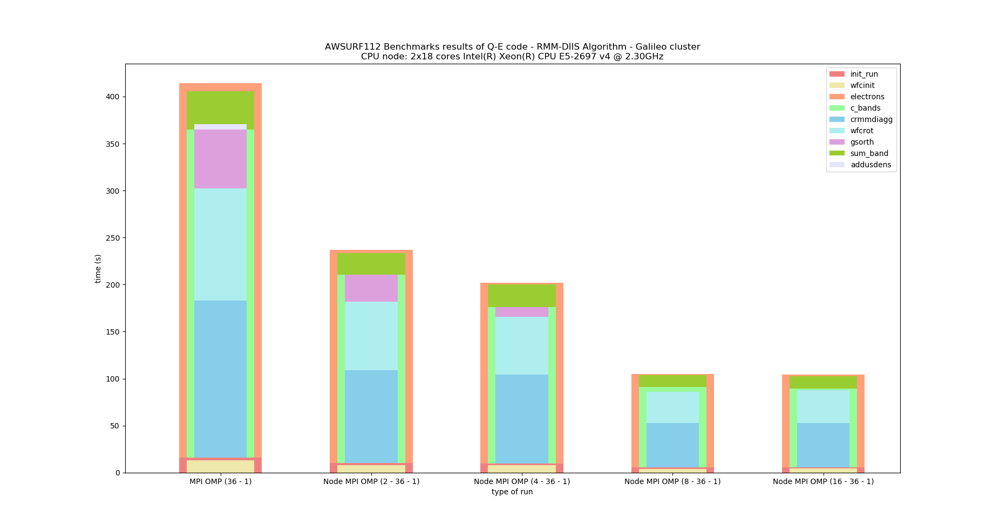
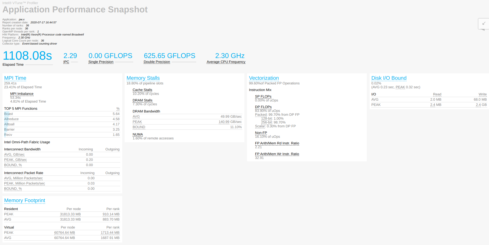
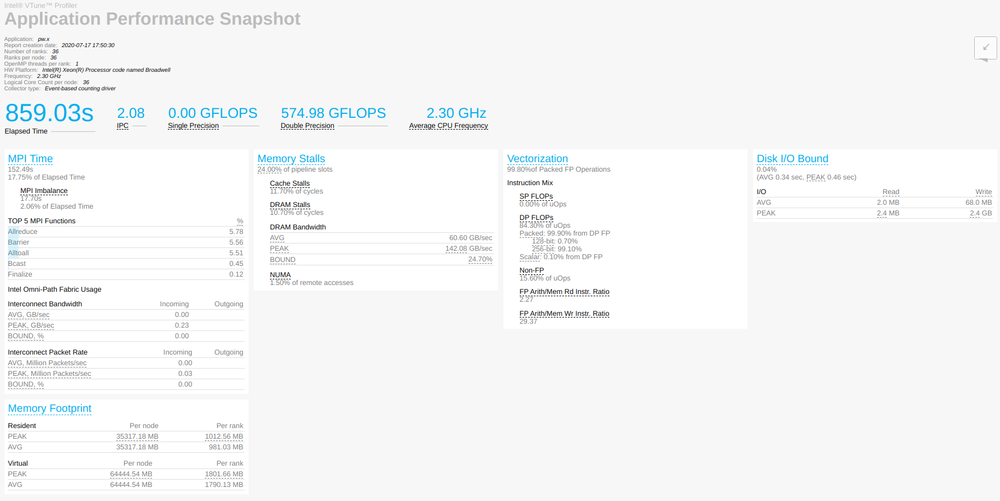

## Quantum Espresso: Ausurf benchmark of RMM-DIIS alorithm and Davidson algorithm

### Installation

I installed the version of 6.5.1 release of QE, in the parallel set-up linking the extarnal lapack and scalapack libraries.

```
./configure --enable-openmp --with-sclapack=intel
```

And i compile with intel compiler. loading the following modules:

```
 1) intel/pe-xe-2018--binary                
 2) intelmpi/2018--binary                   
 3) mkl/2018--binary                        
 4) scalapack/2.0.2--intelmpi--2018--binary 
```

### Ausurf benchmark: MPI scaling , 10 iterations

In this section a report  the analysis on the MPI-scaling of the two algorithms when i increased the number of nodes and of processors (36*n_node ).

To run the simulation i exported the OMP_NUM_THREADS to 1 and repeated it on 1, 2, 4, 8, 16 nodes.

 I used the input file of the ausurf benchmark where i change the `electron_maxstep=10`, to make it a bit longer so that i could make it run consistently even for a large number of nodes.

In this analysis i don't want to compare the two algorithms between them as the kind of steps that they're are doing are different and it doesn't make sense to compare them not in a full convergence test. I will present a comparison between them in the following section, together with some report of profiling tools for intel. 

In the section i report how they scale increasing the number of MPI processes, using the python script to produce the output `graph.py`. In the script, there is a variable called **at_least** which define a threshold value in percent. If the code spent, in a subroutine, more than at_leastpercent of time of the caller routine then the subroutine will be
displayed on the graph. By default this value is set to **10%**.

#### Davidson Algorithm



#### RMM-DIIS Algorithm

 



### Ausurf benchmark: MPI scaling , convergence test

 I used the input file of the ausurf benchmark where i change the `electron_maxstep=1000`,  to be sure to not limited the number of steps before the algorithm stop as they arrive at the convergence. 

I run the simulations with : 

- 1 node , 36 processes, 1 OMP thread 

| ALGORITHM | CPU_TIME  | WALL_TIME | Total energy       |
| --------- | --------- | --------- | ------------------ |
| DAVIDSON  | 17m24.47s | 18m46.87s | -11427.09402162 Ry |
| RMM-DIIS  | 12m49.36s | 13m51.65s | -11427.09402145 Ry |


- 2 nodes,  72 processes, 1 OMP thread

| ALGORITHM | CPU_TIME | WALL_TIME | Total energy    |
| --------- | -------- | --------- | --------------- |
| DAVIDSON  |          |           |                 |
| RMM-DIIS  | 8m 1.42s | 9m 0.01s  | -11427.09402106 |


#### APS report

I repeat the run on 1 node using the profiling tool of APS (Application Performance Snapshot), these are the report that i obtained.

##### Davidson




##### RMM-DIIS




