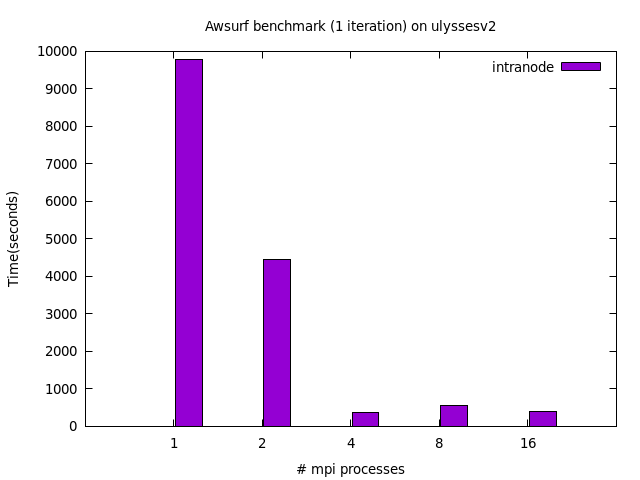
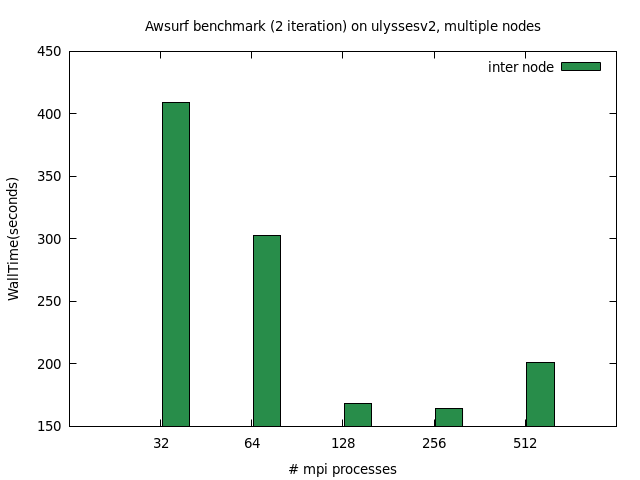
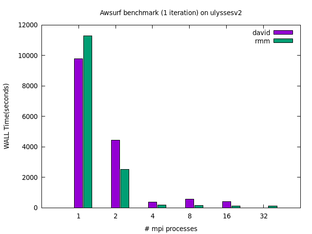
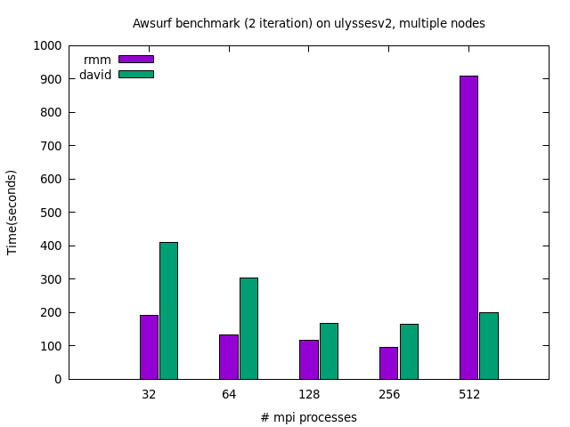

### Installation of QE-6.5  Ulysses-v2

The code is downloaded from the github repository  https://github.com/QEF/q-e.git , and configure and installed such that it can run in parallel on multi processes and using the scalapack Library.

There were some difficulties to configure and compile the code linking the scalapack library and i should add the direct path to this lybrary in the enviroment variables LIBRARY_PATH.

The flags used in the configure are explained by `./configure --help`.

I forced the compiler to be intel and not fortran, and i asked for the parallel compiler. mpif90.

The exact name of the mkl library can be seen in `ls $MKLROOT/lib/intel64` 

**Module Loaded **

gcc/8

intel/19.0.4.243

openmpi3/3.1.4

scalapack/2.0.2


**Enviroment variables**

FC="mpif90"

SCALAPACK_LIBS="-L$SCALAPACK_LIB -lscalapack"

LIBS="-lscalapack -lmkl_intel_lp64 -lmkl_intel_thread -lmkl_core -qopenmp"

export LIBRARY_PATH="/opt/ohpc/pub/libs/intel/openmpi3/scalapack/2.0.2/lib:$LIBRARY_PATH"


**Configure Flags**

LDFLAGS="-L/opt/ohpc/pub/libs/intel/openmpi3/scalapack/2.0.2/lib  -L$MKLROOT/lib/intel64 -qopenmp -lmkl_intel_lp64 -lmkl_intel_thread -lmkl_core"

EXTLIB_FLAGS="$LIBS"

FCFLAGS="$LIBS"

FFFLAGS="$LIBS"


#### RISM installation

The repository for the code with RISM diagonalization is  in the branch  `remotes/origin/qe-6.5-rism`.

I configure it and compiled using the flags and enviroment variables set us above.

Note that the make.inc produced compiling with these flags is a bit different with the one obtained before as for example the Lapack libraries are internal. *( So probabily i export wrongly some compiled flags?)*

 

### AWSURF112 Benchmark

#### Davidson diagonalization

**Intranode test**:

```
mpirun -np $n ../qe-6.5/bin/pw.x -input ausurf.in	
```

with n=1, 2, 4, 8, 16, 32

For this test, as the WALL time was quite significative i set to 1 the iteration number in the input file, so it runs for just one iteration.



**Internode test**

```
mpirun -np $n --map-by ppr:32:node ../qe-6.5/bin/pw.x -input ausurf.in
```

with n=32, 64, 128, 256

In this case as the WALL time was quite short,  the simulation run for two interations.




#### David vs RMM 

**intranode**




**internode**



